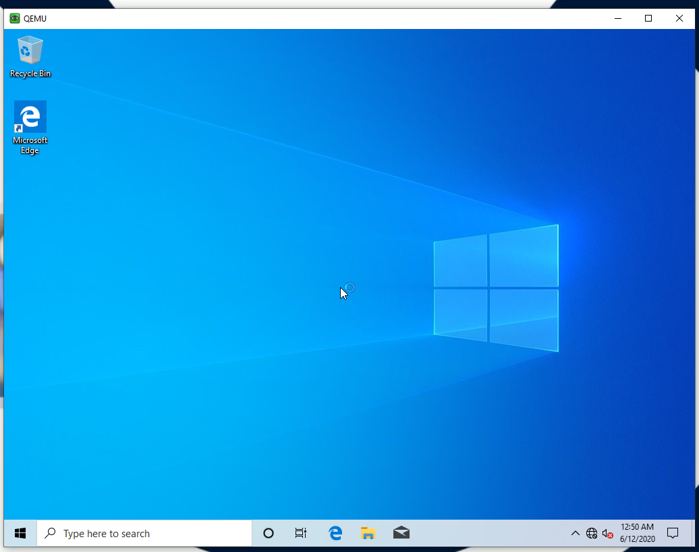

# win10 in docker

Run headless container. Connect via VNC.



## Before you start

You must have enabled KVM on the host. 

```sh
systemctl enable libvirtd.service
systemctl enable virtlogd.service
modprobe kvm_intel
```

### Download Windows 10 ISO image

Get official [Windows 10 ISO image](https://www.microsoft.com/en-us/software-download/windows10) from official source. This [tutorial](https://gist.github.com/eladkarako/970cd72238d2b3e08c4d3fb7723563af#file-latest-official-genuine-windows10-download-links-iso-without-the-media-creation-tool-md) might come in handy.

### Create HDD

Create HDD image, where system will be installed. Choose custom disk size.

```sh
docker build -t win10-hdd -f hdd.Dockerfile .
docker run --rm -v $PWD:/data win10-hdd 128G
```

## Build and run container

In order to use KVM inside container, it needs to run as privileged. Do not forget to mount files we created earlier:
* Mount downloaded Windows ISO as `/home/arch/win10_x64.iso`.
* Mount created HDD as `/home/arch/win10_hdd.img`.

```sh
docker build -t win10 .
docker run -d --name win10-in-docker \
	-p 5901:5901 \
	--privileged --cap-add=ALL \
	-v /lib/modules:/lib/modules \
	-v /dev:/dev \
	-v $PWD/Win10_2004_English_x64.iso:/home/arch/win10_x64.iso \
	-v $PWD/win10_hdd.img:/home/arch/win10_hdd.img \
	win10
```

Inspired by:
* https://github.com/sickcodes/Docker-OSX
* https://www.funtoo.org/Windows_10_Virtualization_with_KVM

### Is This Legal?

You need to have valid licence and download Windows 10 ISO image from official sources. This contaier just helps with virtualization.
